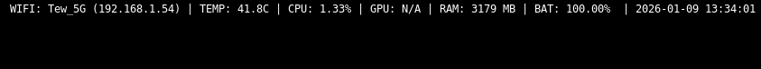
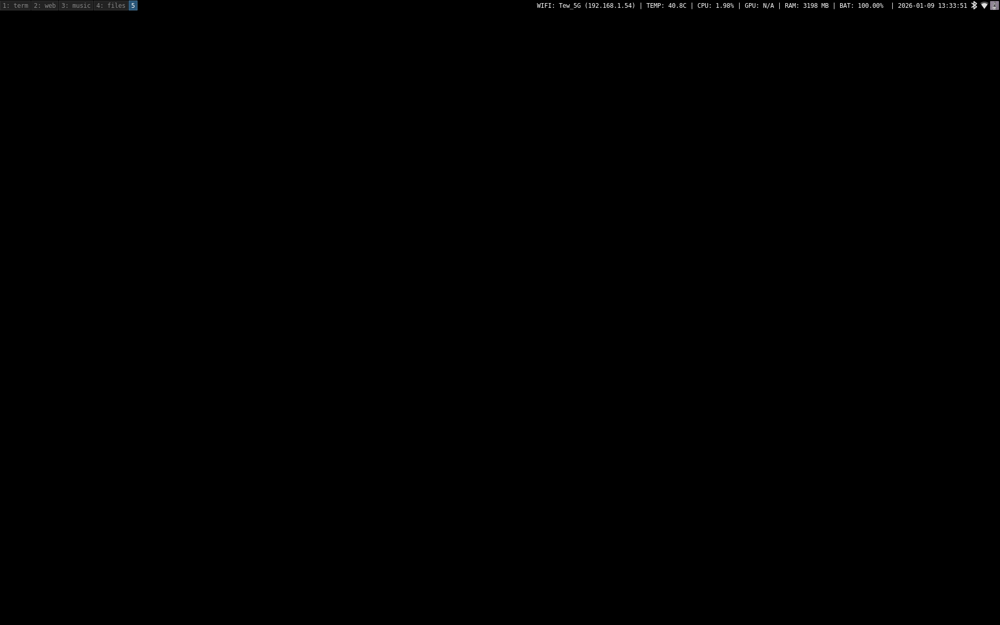
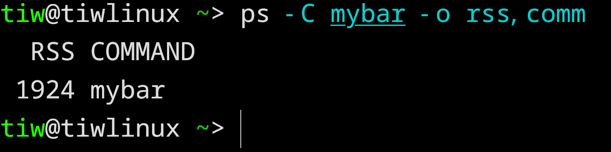

# cbar

**ngl i was too lazy to use polybar. it uses like 50mb ram for what? colors?**

so i made this. **1.9mb**. pure c. reads straight from `/proc` and `/sys`. 

no bullshit. just your system stats.

## Preview (⁠・⁠∀⁠・⁠)









## what it does

shows you:
- **wifi**: ssid + ip (because "connected" tells you nothing)
- **cpu**: actual usage %, not load average nonsense
- **gpu**: nvidia, amd, intel. auto-detects.
- **ram**: how much you're actually using
- **disk**: usage % + write speed (because why not)
- **temp**: cpu temp from wherever it is on your system
- **battery**: % + charging status
- **time**: it's 2026, you still need a clock

updates every 1-5 seconds depending on what actually changes.

## the stack (install these first)

if you don't have these, `make` will probably scream at you:
```bash
# arch btw
sudo pacman -S base-devel

# debian/ubuntu normies
sudo apt install build-essential

# you also need these for full features
sudo pacman -S wireless_tools  # for iwgetid
```

**optional but recommended:**
- `nvidia-smi` if you have nvidia gpu
- or just let it fallback to `/sys/class/drm` for amd/intel

## installation
```bash
git clone https://github.com/tiw302/cbar
cd cbar
make
sudo make install
```

done. binary is now at `/usr/local/bin/cbar`

## configuration

edit `config.h`:
```c
#define BATTERY_NAME "BAT0"       // might be BAT1, check: ls /sys/class/power_supply/
#define WIFI_INTERFACE "wlan0"    // might be wlp3s0, check: ip link
```

then rebuild:
```bash
make clean && make
sudo make install
```

yeah it's compile-time config. suckless style. if you want a config file, polybar is that way

## usage

### i3

add to `~/.config/i3/config`:
```bash
bar {
    status_command cbar
    position top
}
```

### sway

add to `~/.config/sway/config`:
```bash
bar {
    status_command cbar
    position top
}
```

restart your wm: `$mod+Shift+r`

## output looks like
```
WIFI: HomeNet (192.168.1.5) | TEMP: 45.0C | CPU: 12.34% | GPU: 15% | RAM: 1024 MB | DISK: 45% | IO: 2.3 KB/s | BAT: 85.23% CHR | 2026-01-10 20:45:00
```

clean. readable. gets the job done.

## coming soon

**cbar-color** - colored version for people who like pretty things

- 🟢 green = good
- 🟡 yellow = warning
- 🔴 red = oh no

memory usage: ~2.3mb (still way better than polybar's 50mb)

eta: 2-3 days. ⭐ this repo for updates.

## why tho

**existing bars:**
- polybar: 50mb ram, c++, needs config file, slow startup
- i3status: can't show gpu, boring output, limited customization
- waybar: 60mb+, gtk bloat, overkill for simple stats

**cbar:**
- 1.9mb ram
- pure c
- fast af
- does everything you need
- code is like 300 lines, you can read it in 5 minutes

built following suckless principles because:
- software should be simple
- you shouldn't need a phd to understand your status bar
- less code = less bugs

## performance

| bar | ram | startup | cpu | language |
|-----|-----|---------|-----|----------|
| **cbar** | 1.9mb | instant | <0.1% | c |
| i3status | 3-5mb | fast | <0.5% | c |
| polybar | 50mb | slow | 1-2% | c++ |
| waybar | 60mb | slower | 2-3% | c++ |

tested on a potato (thinkpad x220). if it runs there, it runs anywhere.

## features you won't find elsewhere

- **smart updates**: wifi/battery check every 5s, cpu/ram every 1s. no point hammering /proc for stuff that doesn't change.
- **multi-gpu**: tries nvidia-smi first, falls back to amd/intel sysfs. just works™
- **disk i/o**: shows actual write speed from /proc/diskstats. useful for knowing if your ssd is dying.
- **auto hardware detection**: finds your battery, cpu temp sensor, disk. no manual paths (mostly).

## disclaimer !!!

**read this:** this repo contains ONLY the status bar code. 

i'm not including my entire dotfiles. you're on your own for:
- i3/sway config
- terminal config  
- launcher config
- literally everything else

if something doesn't work, that's between you and google. :>

## troubleshooting

**"my battery is BAT1 not BAT0"**
- edit `config.h`, change `BATTERY_NAME`, recompile

**"wifi shows N/A"**
- check if `iwgetid` is installed
- check if `WIFI_INTERFACE` is correct: `ip link`

**"gpu shows N/A"**
- nvidia: install `nvidia-smi`
- amd/intel: should just work, check `/sys/class/drm/card0/device/gpu_busy_percent` exists

**"temp shows N/A"**
- your hwmon might be weird, check `/sys/class/hwmon/hwmon*/name`
- pr welcome if you know the fix for your hardware

**"it doesn't compile"**
- install `build-essential` or `base-devel`
- if it still breaks, open an issue with the error

## contributing

prs welcome but keep it minimal. 

if your pr adds 500 lines for a feature 3 people will use, probably not merging it.

if you want to add rgb lighting support or anime waifus, make a fork. no judgment.

## philosophy

> programs should do one thing well

cbar shows system stats. that's it. 

- no music player controls
- no system tray
- no weather (use wttr.in)
- no todo lists
- no notification center

if you need those, use multiple tools. unix way.

## license

MIT. do whatever you want. credit appreciated but not required.

## credits

made by someone who got tired of waiting for polybar to start.

inspired by dwm, st, and other suckless projects.

if this helped you, ⭐ the repo. if not, that's cool too.
