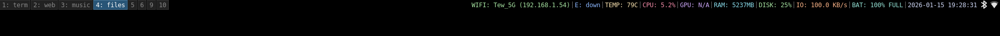

# cbar

**ngl i was too lazy to use polybar. it uses like 50mb ram for what? colors?**

so i made this. **1.9mb**. pure c. reads straight from `/proc` and `/sys`. 

no bullshit. just your system stats.

## Preview (⁠・⁠∀⁠・⁠)

**bar:**




**preview:**


**use-ram:**


## what it does

shows you:
- **wifi**: ssid + ip (because "connected" tells you nothing)
- **cpu**: actual usage %, not load average nonsense
- **gpu**: nvidia, amd, intel. auto-detects.
- **ram**: how much you're actually using
- **disk**: usage % + write speed (because why not)
- **temp**: cpu temp from wherever it is on your system
- **battery**: % + charging status
- **time**: it's 2026, you still need a clock

updates every 1-5 seconds depending on what actually changes.

## the stack (install these first)

if you don't have these, `make` will probably scream at you:
```bash
# arch btw
sudo pacman -S base-devel

# debian/ubuntu normies
sudo apt install build-essential

# you also need these for full features
sudo pacman -S wireless_tools  # for iwgetid
```

**optional but recommended:**
- `nvidia-smi` if you have nvidia gpu
- or just let it fallback to `/sys/class/drm` for amd/intel

## installation
```bash
git clone https://github.com/tiw302/cbar
cd cbar
make
sudo make install
```

done. binary is now at `/usr/local/bin/cbar`

## configuration

### 🎨 `src/config.h` - this is where the magic happens

open `src/config.h` and you'll see this:

#### **1. Hardware Settings**

```c
#define WIFI_INTERFACE  "wlan0"
#define ETH_INTERFACE   "eth0"
#define BATTERY_PATH    "/sys/class/power_supply/BAT0"
```

**what to change:**

- **`WIFI_INTERFACE`**: your wifi card name
  - find yours: `ip link` or `iwconfig`
  - common values: `wlan0`, `wlp3s0`, `wlo1`
  - example: if you see `wlp3s0`, change to `#define WIFI_INTERFACE "wlp3s0"`

- **`ETH_INTERFACE`**: your ethernet card name
  - find yours: `ip link`
  - common values: `eth0`, `enp2s0`, `eno1`
  - if you don't have ethernet, leave it as is (it'll just show "down")

- **`BATTERY_PATH`**: your battery location
  - find yours: `ls /sys/class/power_supply/`
  - common values: `BAT0`, `BAT1`, `BAT2`
  - example: if you see `BAT1`, change to `#define BATTERY_PATH "/sys/class/power_supply/BAT1"`
  - desktop users: leave as is, it'll show "PWR: AC" automatically

#### **2. Colors (Hex Codes)**

```c
#define COLOR_WIFI   "#adadad" // Gray
#define COLOR_ETH    "#adadad" // Gray
#define COLOR_TEMP   "#d1d1d1" // Light gray
#define COLOR_CPU    "#d1d1d1" // Light gray
#define COLOR_GPU    "#d1d1d1" // Light gray
#define COLOR_RAM    "#d1d1d1" // Light gray
#define COLOR_DISK   "#d1d1d1" // Light gray
#define COLOR_IO     "#d1d1d1" // Light gray
#define COLOR_BAT    "#ffffff" // White
#define COLOR_TIME   "#ffffff" // White
```

**customize your colors:**

want a colorful bar? change the hex codes:

```c
#define COLOR_WIFI   "#00ff00" // Green
#define COLOR_CPU    "#ff0000" // Red
#define COLOR_RAM    "#00ffff" // Cyan
#define COLOR_BAT    "#ffff00" // Yellow
```

**color picker:** use any hex color picker online or:
- red: `#ff0000`
- green: `#00ff00`
- blue: `#0000ff`
- cyan: `#00ffff`
- magenta: `#ff00ff`
- yellow: `#ffff00`
- orange: `#ff8800`
- purple: `#8800ff`

#### **3. Performance Settings**

```c
#define REFRESH_RATE_MS 1000      // Update interval in milliseconds
#define SLOW_UPDATE_CYCLE 5       // Update slow modules every N cycles
```

**what these do:**

- **`REFRESH_RATE_MS`**: how often the bar updates (in milliseconds)
  - default: `1000` (1 second)
  - lower = faster updates, higher cpu usage
  - higher = slower updates, lower cpu usage
  - recommended range: `500-2000`

- **`SLOW_UPDATE_CYCLE`**: how often to update "slow" modules (gpu, network, temp, disk, battery)
  - default: `5` (every 5 seconds)
  - these don't change much, so no point checking every second
  - higher = less system load, slower updates for these modules
  - recommended range: `3-10`

**example configs:**

```c
// Ultra-fast (uses more cpu)
#define REFRESH_RATE_MS 500
#define SLOW_UPDATE_CYCLE 3

// Balanced (default)
#define REFRESH_RATE_MS 1000
#define SLOW_UPDATE_CYCLE 5

// Power-saving (laptop on battery)
#define REFRESH_RATE_MS 2000
#define SLOW_UPDATE_CYCLE 10
```

### after changing `config.h`:

```bash
make clean && make
sudo make install
```

restart your wm: `$mod+Shift+r`

---

## makefile explained

because some people actually care about this:

```makefile
CC ?= gcc                          # compiler (use gcc or clang)
CFLAGS += -std=c99 -Wall -O2       # compilation flags
PREFIX ?= /usr/local               # install location
BINDIR = $(PREFIX)/bin             # binary goes here
```

**useful commands:**

```bash
# compile
make

# install to /usr/local/bin
sudo make install

# install to custom location (e.g. ~/.local/bin)
make PREFIX=~/.local install

# clean build files
make clean

# uninstall
sudo make uninstall

# compile with debug symbols (for development)
make CFLAGS="-std=c99 -Wall -g"
```

**custom compiler:**

```bash
# use clang instead of gcc
make CC=clang

# compile with extra warnings
make CFLAGS="-std=c99 -Wall -Wextra -Wpedantic -O2"
```

---

## usage

### i3

add to `~/.config/i3/config`:
```bash
bar {
    status_command cbar
    position top
    
    # optional: customize bar appearance
    colors {
        background #000000
        statusline #ffffff
    }
}
```

### sway

add to `~/.config/sway/config`:
```bash
bar {
    status_command cbar
    position top
}
```

restart your wm: `$mod+Shift+r`

## output looks like
```
WIFI: HomeNet (192.168.1.5) | E: down | TEMP: 45.0C | CPU: 12.34% | GPU: 15% | RAM: 1024 MB | DISK: 45% | IO: 2.3 KB/s | BAT: 85.23% CHR | 2026-01-10 20:45:00
```

clean. readable. gets the job done.

## why tho

**existing bars:**
- polybar: 50mb ram, c++, needs config file, slow startup
- i3status: can't show gpu, boring output, limited customization
- waybar: 60mb+, gtk bloat, overkill for simple stats

**cbar:**
- 1.9mb ram
- pure c
- fast af
- does everything you need
- code is like 350 lines, you can read it in 5 minutes

built following suckless principles because:
- software should be simple
- you shouldn't need a phd to understand your status bar
- less code = less bugs

## performance

| bar | ram | startup | cpu | language |
|-----|-----|---------|-----|----------|
| **cbar** | 1.9mb | instant | <0.1% | c |
| i3status | 3-5mb | fast | <0.5% | c |
| polybar | 50mb | slow | 1-2% | c++ |
| waybar | 60mb | slower | 2-3% | c++ |

tested on a potato (thinkpad x220). if it runs there, it runs anywhere.

## features you won't find elsewhere

- **smart updates**: wifi/battery check every 5s, cpu/ram every 1s. no point hammering /proc for stuff that doesn't change.
- **multi-gpu**: tries nvidia-smi first, falls back to amd/intel sysfs. just works™
- **disk i/o**: shows actual write speed from /proc/diskstats. useful for knowing if your ssd is dying.
- **auto hardware detection**: finds your battery, cpu temp sensor, disk. no manual paths (mostly).

## troubleshooting

**"my battery is BAT1 not BAT0"**
- edit `src/config.h`, change `BATTERY_PATH`, recompile

**"wifi shows N/A"**
- check if `iwgetid` is installed: `sudo pacman -S wireless_tools`
- check if `WIFI_INTERFACE` is correct: `ip link`
- edit `src/config.h` and fix the interface name

**"gpu shows N/A"**
- nvidia: install `nvidia-smi`
- amd/intel: should just work, check `/sys/class/drm/card0/device/gpu_busy_percent` exists

**"temp shows N/A"**
- your hwmon might be weird, check `/sys/class/hwmon/hwmon*/name`
- pr welcome if you know the fix for your hardware

**"it doesn't compile"**
- install `build-essential` or `base-devel`
- make sure you're in the cbar directory
- if it still breaks, open an issue with the error

**"bar doesn't show up after restart"**
- check if cbar is running: `ps aux | grep cbar`
- check i3/sway logs: `journalctl -xe`
- try running manually: `cbar` and see if there are errors

## disclaimer !!!

**read this:** this repo contains ONLY the status bar code. 

i'm not including my entire dotfiles. you're on your own for:
- i3/sway config
- terminal config  
- launcher config
- literally everything else

if something doesn't work, that's between you and google. :>

## contributing

prs welcome but keep it minimal. 

if your pr adds 500 lines for a feature 3 people will use, probably not merging it.

if you want to add rgb lighting support or anime waifus, make a fork. no judgment.

## philosophy

> programs should do one thing well

cbar shows system stats. that's it. 

- no music player controls
- no system tray
- no weather (use wttr.in)
- no todo lists
- no notification center

if you need those, use multiple tools. unix way.

## license

MIT. do whatever you want. credit appreciated but not required.

## credits

made by someone who got tired of waiting for polybar to start.

inspired by dwm, st, and other suckless projects.

if this helped you, ⭐ the repo. if not, that's cool too.

---

**tl;dr:**
1. `git clone` this
2. edit `src/config.h` (wifi interface, battery name, colors)
3. `make && sudo make install`
4. add `status_command cbar` to your i3/sway config
5. `$mod+Shift+r`
6. done. go touch grass.
